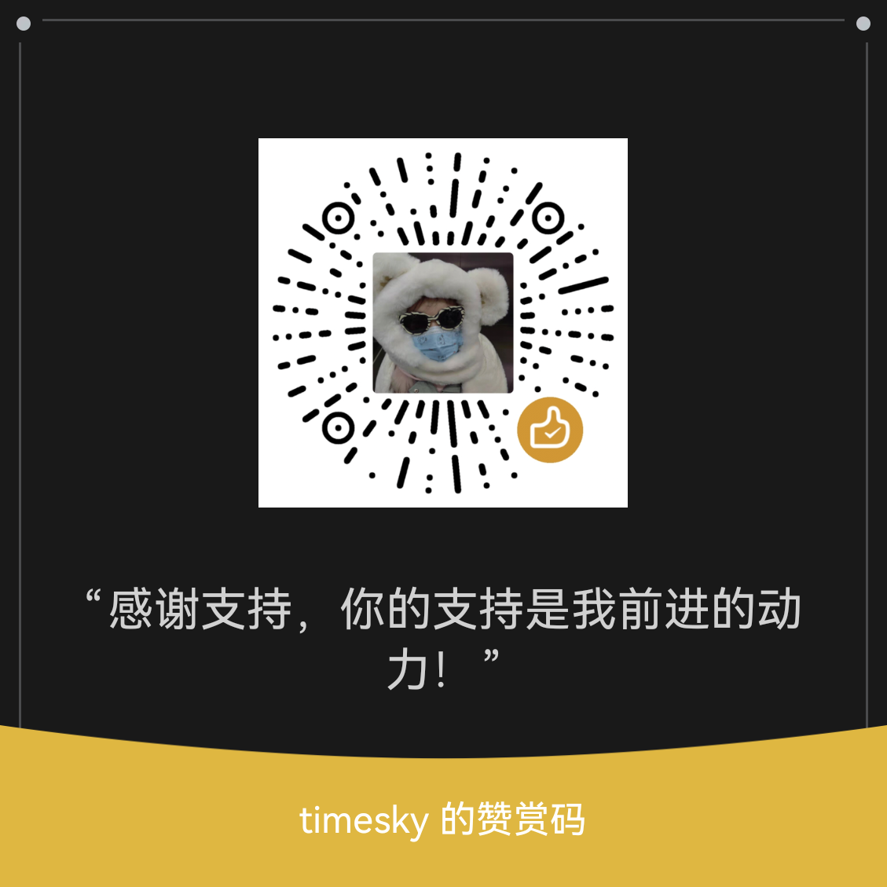

# Hermes Skills

Hermes Agent 技能仓库 - 自建技能 + 必备开源技能推荐

参考：[anthropics/skills](https://github.com/anthropics/skills)

---

## 自建技能列表

### MCN 系列（公众号自动化）

| 技能 | 说明 | 状态 |
|------|------|------|
| `wechat-mp-auto-publish` | 入口技能（唯一入口），定时任务 + 人工确认 | ✅ 维护中 |
| `mcn-hotspot-aggregator` | 热搜抓取（知乎/微博/抖音等） | ✅ 维护中 |
| `mcn-topic-selector` | 选题分析（相关性评分） | ✅ 维护中 |
| `mcn-content-rewriter` | 内容改写（多版本文章） | ✅ 维护中 |
| `mcn-wechat-publisher` | 公众号发布（API + 浏览器） | ✅ 维护中 |

### 知识库系列

| 技能 | 说明 | 状态 |
|------|------|------|
| `wiki-auto-save` | 自动保存搜索内容到知识库 tmp 目录 | ✅ 维护中 |
| `wiki-ingest` | 增量式 ingest 流程，raw → wiki | ✅ 维护中 |

### 运维备份

| 技能 | 说明 | 状态 |
|------|------|------|
| `hermes-backup` | Hermes 完整备份与恢复，支持跨机器迁移 | ✅ 维护中 |

### 开发工具

| 技能 | 说明 | 状态 |
|------|------|------|
| `skill-optimizer` | Skill 自动优化（Autoresearch 方法） | ✅ 维护中 |

---

## 目录结构

```
hermes-skills/
├── README.md                 # 本说明文件
├── THIRD_PARTY_SKILLS.md     # 必备开源技能列表
├── skills/                   # 自建技能目录
│   ├── mcn/                  # 公众号自动化（5个技能）
│   ├── note-taking/          # 知识库管理（2个技能）
│   ├── devops/               # 运维备份（1个技能）
│   └── software-development/ # 开发工具（1个技能）
└── templates/                # 技能模板
```

---

## 使用说明

### 安装自建技能

```bash
# 克隆仓库
git clone git@github.com:timesky/hermes-skills.git

# 复制技能到 Hermes
cp -r hermes-skills/skills/* ~/.hermes/skills/
```

### 恢复备份

使用 `hermes-backup` 技能：

```bash
python3 ~/.hermes/scripts/restore_hermes.py --backup latest
```

---

## 必备第三方技能

见：[THIRD_PARTY_SKILLS.md](./THIRD_PARTY_SKILLS.md)

---

## 图片目录说明

```
images/
└── appreciation/     # 赞赏相关
    ├── wechat-pay.jpg
    └── alipay.jpg
```

---

*Last updated: 2026-04-12 by Luna*

---

如果这些技能对你的工作有帮助，欢迎请我喝杯咖啡 ☕

| 微信 | 支付宝 |
|:---:|:---:|
|  |  |

*开源不易，感谢支持~*